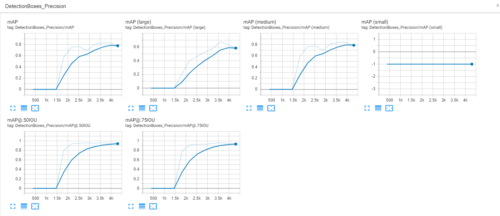
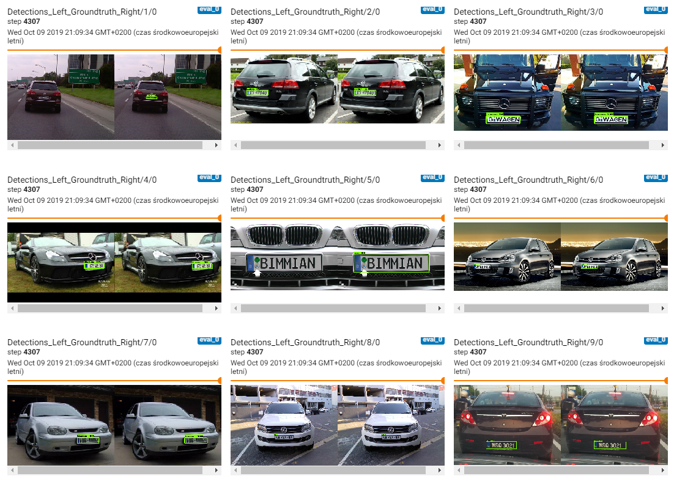

## Tensorflow-Lite object detection 
Transfer Learning . 

This repo is just an simple version of 

[Tensorflow transfer learning on TPU](https://medium.com/tensorflow/training-and-serving-a-realtime-mobile-object-detector-in-30-minutes-with-cloud-tpus-b78971cf1193)

### Deploy

Running on Intel Compute stick 2 

#### Installation 

as mention in [documentation](https://github.com/tensorflow/models/blob/master/research/object_detection/g3doc/installation.md), 

installation requires as follows:

###
- Protobuf 3.0.0
- Python-tk
- Pillow 1.0
- lxml
-tf Slim (which is included in the "tensorflow/models/research/" checkout)
- Jupyter notebook
- Matplotlib
- Tensorflow (>=1.12.0)
- Cython
- contextlib2
- cocoapi

#### Run training

add python path
export PYTHONPATH=$PYTHONPATH=/home/s3nh/tf-mobilenet/models/research:/home/s3nh/tf-mobilenet/models/research/slim

Create tf records

python utils/create_licence_tf_record.py --csv_input=dataset/benchmarks/endtoend/labels.csv  --output_dir=training/train.record --image_dir=dataset/benchmarks/endtoend/eu

train, based on pipeline.config file and training files. 
python3 models/research/object_detection/model_main.py  --logtostderr --train_dir=training/ --pipeline_config_path=training/pipeline.config

#### Results after 4000 steps 

#### Predictions 

#### Classification sample 

stored into openvino/deployment_tools/inference_engine/samples/python_samples/classification_sample 

### Step by step installation 

##### Darft

1  clone tensorflow object detection api repo
2. prepare dataset for 
object detection instance
3. Convert dataset to .tfrecords dataset
4. train model using chosen pretrained topology.
5. save tf checkpoints 
6. convert checkpoint to frozen_inference_graph 

Converting to frozen_inference_graph.py 

- Question: how to deal with image_tensor input_type, 
which is probably not allowed on intel ncs2 architecture

- OK
python export_inference_graph.py --input_type image_tensor --pipeline_config_path training/faster_rcnn_inception_v2_pets.config --trained_checkpoint_prefix training/model.ckpt-XXXX --output_directory inference_graph

7.  convert .pb model to IR format

Convertion process- . 

 python3 intel/openvino/deployment_tools/model_optimizer/mo_tf.py --input_model=tf-mobilenet/training_mobilenet/frozen_inference_graph.pb --tensorflow_object_detection_api_pipeline_config tf-mobilenet/training_mobilenet/ssd_mobilenet_v2_licence_plate.config --reverse_input_channels

8. Prepare inference engine script. 

#REMINDER 
-

#### Properly convert  INCEPTION_V2 FASTER RCNN MODEL 

 python3 intel/openvino/deployment_tools/model_optimizer/mo_tf.py --input_model=tf-mobilenet/training/frozen_inference_graph.pb --tensorflow_object_detection_api_pipeline_config=tf-mobilenet/training/pipeline.config --reverse_input_channels --input_shape=[1,600,600,3] --log_level=DEBUG --tensorflow_use_custom_operations_config=intel/openvino/deployment_tools/model_optimizer/extensions/front/tf/faster_rcnn_support_api_v1.14.json

##### COnvertion on blob_input_TF

python3 intel/openvino/deployment_tools/model_optimizer/mo_tf.py --input_model=tf-mobilenet/blob_input_TF/frozen_inference_graph.pb --tensorflow_object_detection_api_pipeline_config=tf-mobilenet/blob_input_TF/pipeline.config --reverse_input_channels  --log_level=DEBUG --tensorflow_use_custom_operations_config=intel/openvino/deployment_tools/model_optimizer/extensions/front/tf/faster_rcnn_support_api_v1.14.jsond

##### Sample object detection 

intel/openvino/inference_engine/samples/python_samples/object_detection_sample_ssd/object_detection_sample_ssd.py

